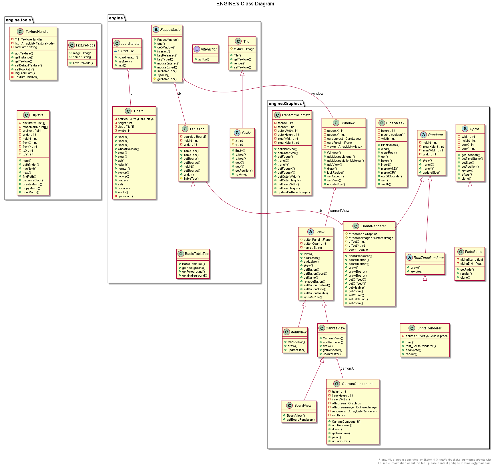
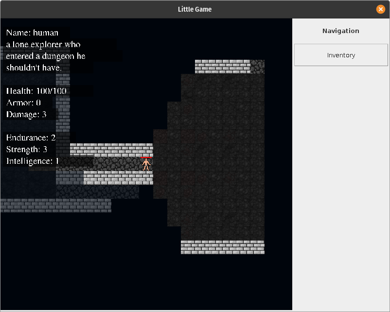
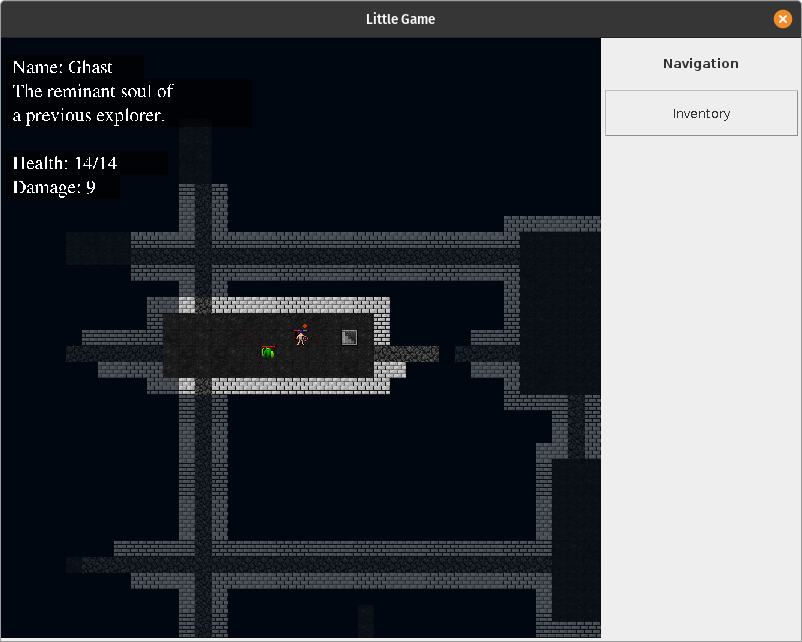
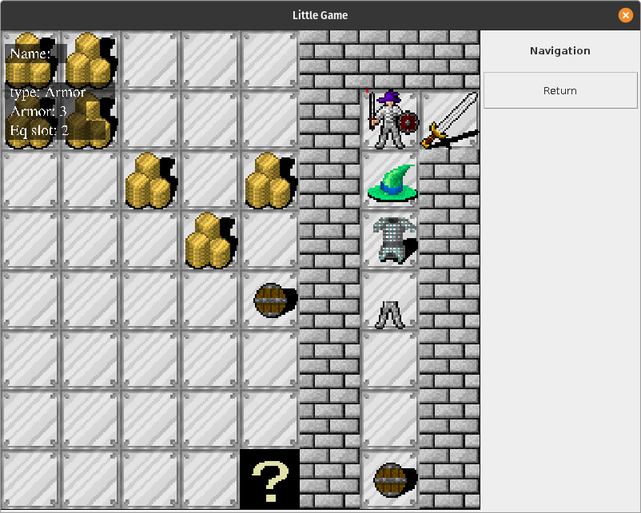
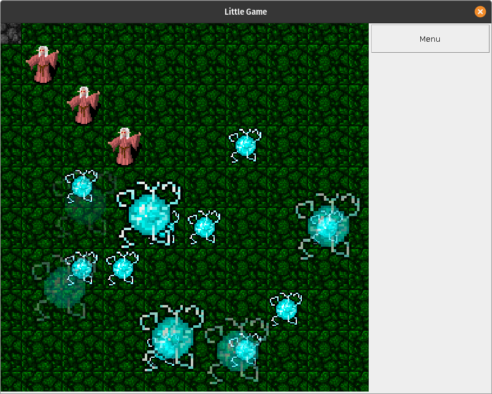
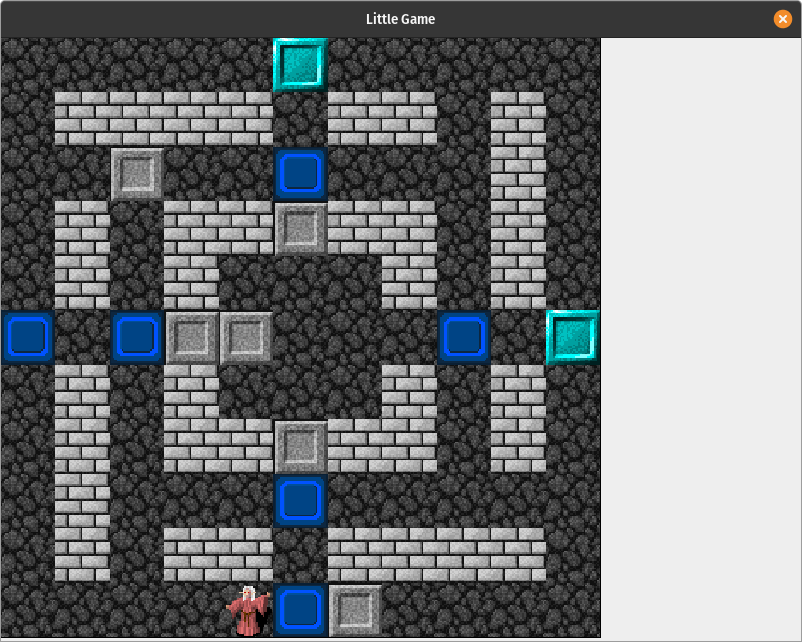

# GridBasedGameEngine
A small grid game framework made for an OOP class.

Using the "engine", we made a quick Sokoban, along with a little dungeon crawler with inventory and some unreasonably persistent enemies that follow you to the ends of the earth using Dijkstra.

# Installation instructions
Run `src/compile.sh` with Java installed, and a jar file will be created in `src/release/`

# Report
Here is an unreasonably long report about this project if anyone wants to read it.
[report](media/Grid_based_java_framework.pdf)

# UML diagram

# Sample videos

# Sample images

